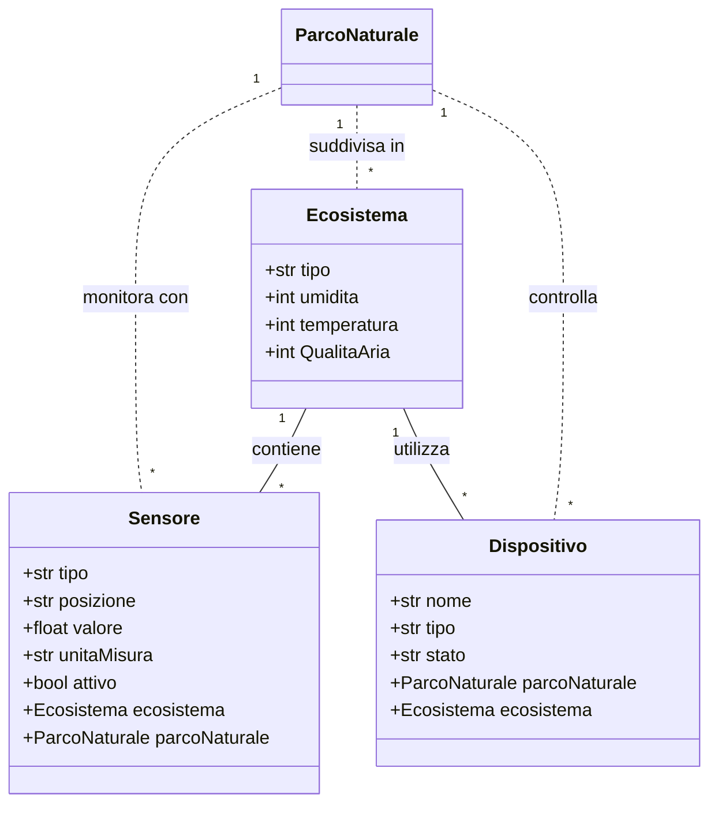

```mermaid
classDiagram
    class ParcoNaturale {

    }

    class Ecosistema {
    +str tipo
    +int umidita
    +int temperatura
    +int QualitaAria
    }

    class Sensore {
    +str tipo
    +str posizione
    +float valore
    +str unitaMisura
    +bool attivo
    +Ecosistema ecosistema
    +ParcoNaturale parcoNaturale
    }

    class Dispositivo {
    +str nome
    +str tipo
    +str stato
    +ParcoNaturale parcoNaturale
    +Ecosistema ecosistema
    }


    ParcoNaturale "1" .. "*" Sensore : monitora con
    ParcoNaturale "1" .. "*" Ecosistema : suddivisa in
    ParcoNaturale "1" .. "*" Dispositivo : controlla
    Ecosistema "1" -- "*" Sensore : contiene
    Ecosistema "1" -- "*" Dispositivo : utilizza

```